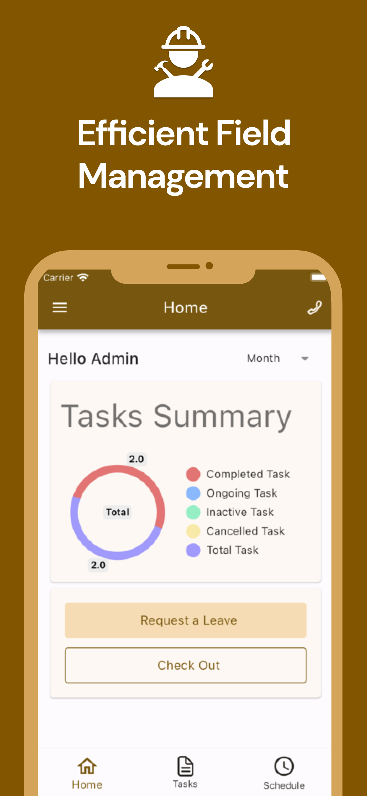
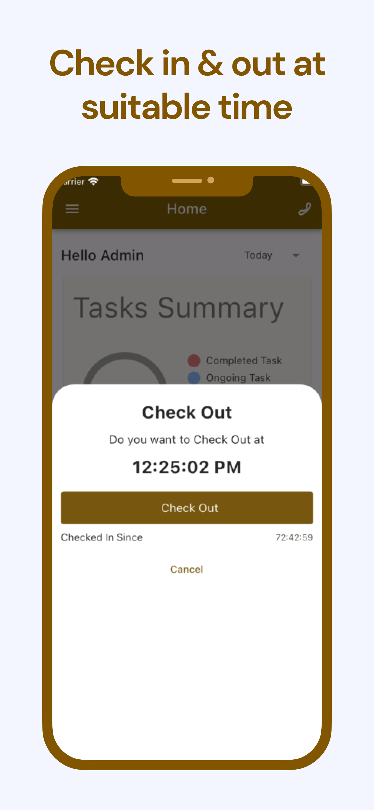
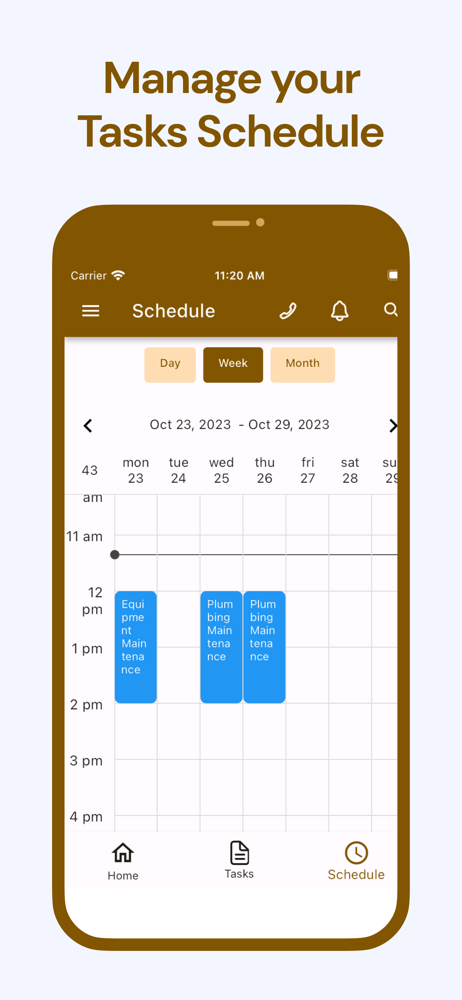
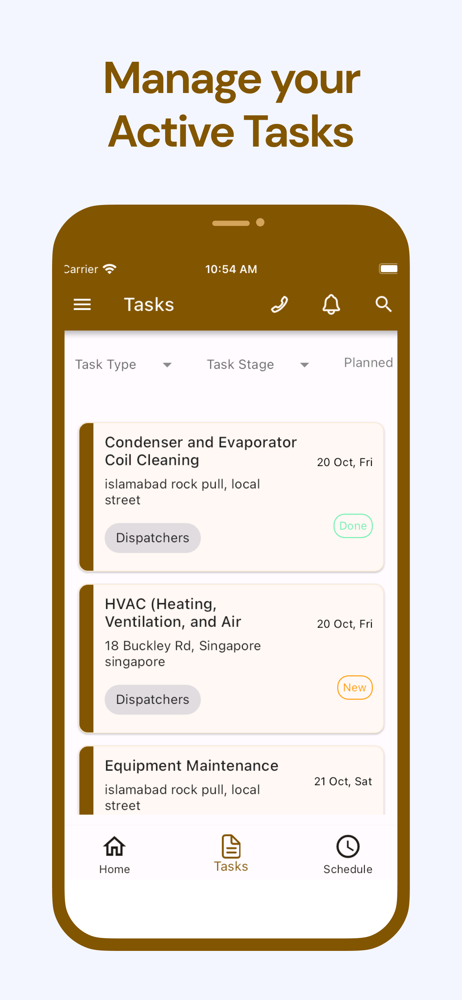
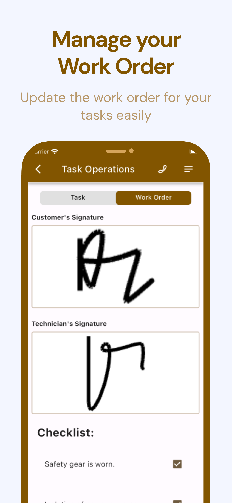
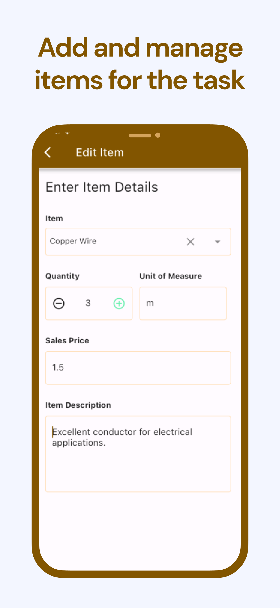
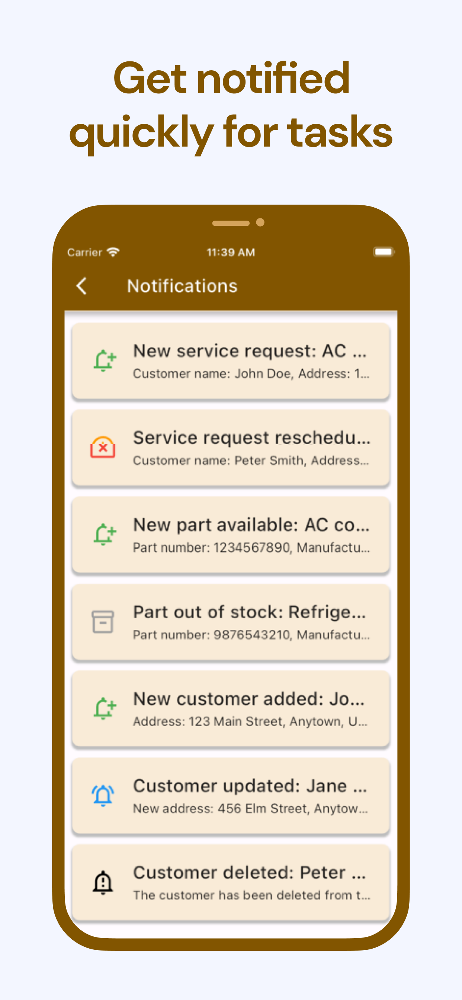

# Note
These commits are coming from github private repository

# EVOLVE FMS

[//]: # ()

This is Field Management System app built using Flutter that communicates with an Odoo back-end using REST APIs.

## Screenshots

